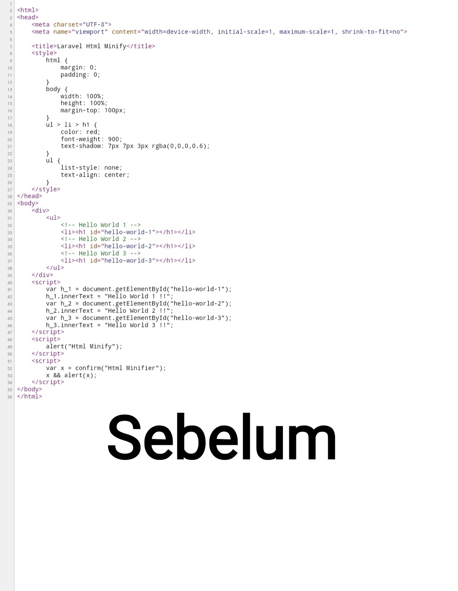
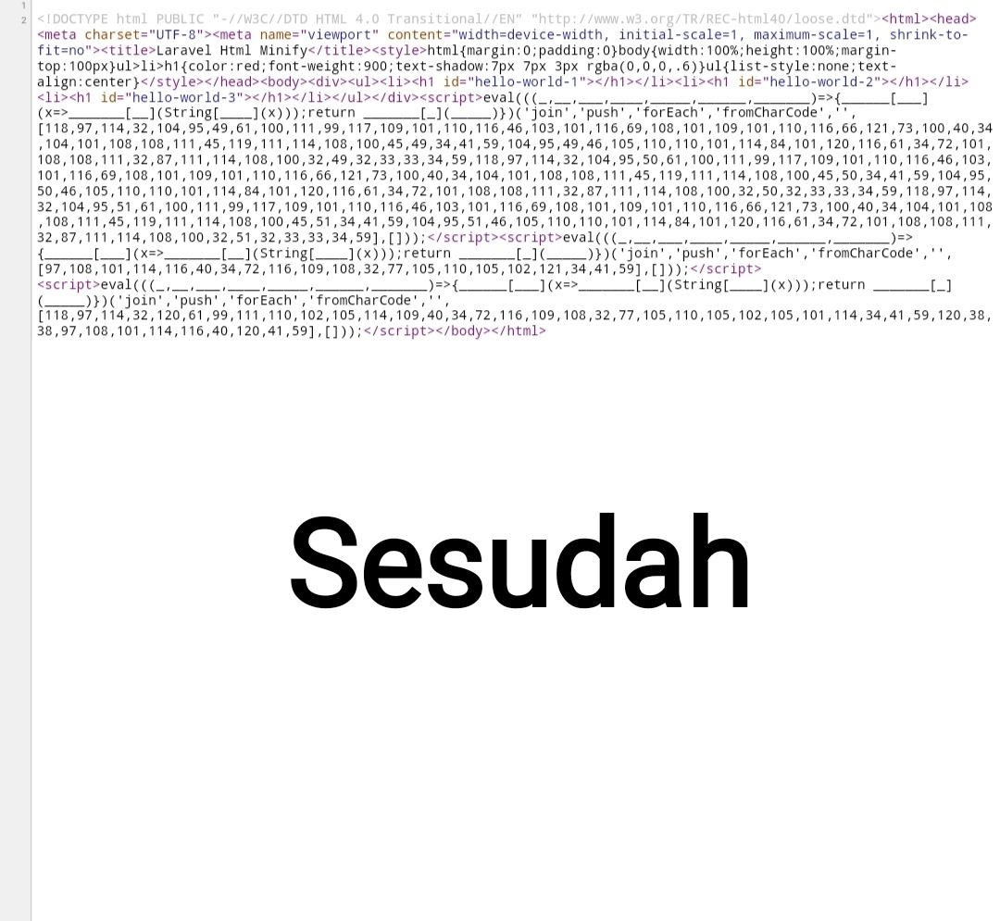

<p align="center">
<a href="https://travis-ci.org/dz-id/laravel-html-minifier"></a>
<a href="https://packagist.org/packages/dz-id/laravel-html-minifier"></a>
<a href="https://packagist.org/packages/dz-id/laravel-html-minifier"></a>
<a href="https://packagist.org/packages/dz-id/laravel-html-minifier"></a>
</p>

# Laravel Html Minifier

Adalah Paket simpel untuk minify HTML, Css Style, dan Javascript sebelum dirender ke browser untuk aplikasi Laravel anda.

Alat ini hanya bekerja jika output yang diberikan adalah bentuk struktur html yang valid meliputi tag html, head dan body. contohnya

- Html yang valid (akan diproses dan diminify)

```html
<html>
   <head>
      <!-- head -->
   </head>
   <body>
      <!-- body -->
   </body>
</html>
```

- Html yang tidak valid (tidak diminify)

```html
< html>
   <head>
      <!-- head -->
   </head>
   <body>
      <!-- body -->
   </body>
</ html>

atau

<html>
   <head>
      <!-- head -->
   </head>
</html>
```

## Contoh Hasilnya :





## Installasi

> **Membutuhkan:**
- **[PHP 7.2.5+](https://php.net/releases/)**
- **[Laravel 6.0+](https://github.com/laravel/laravel)**

## Tahap pertama anda bisa menginstall paket ini dengan [Composer 2x](https://getcomposer.org/download/)

```sh
composer require dz-id/laravel-html-minifier
```

## Publish konfigurasi file

```sh
php artisan vendor:publish --provider="DzId\LaravelHtmlMinifier\HtmlMinifierServiceProvider"
```

## Jangan lupa untuk mendaftarkan ke Global Middleware

[\DzId\LaravelHtmlMinifier\Middleware\MinifyHtml::class](src/Middleware/MinifyHtml.php) dan Middleware lainnya harus didaftarkan ke kernel jika diperlukan, contoh :

```php

// file : app/Http/Karnel.php

protected $middleware = [
    ....
    \DzId\LaravelHtmlMinifier\Middleware\MinifyHtml::class,         // middleware untuk minify html
    \DzId\LaravelHtmlMinifier\Middleware\MinifyCss::class,         // middleware untuk minify css style
    \DzId\LaravelHtmlMinifier\Middleware\MinifyJavascript::class, // middleware untuk minify kode javascript
];
```

## Informasi Middleware

##### [\DzId\LaravelHtmlMinifier\Middleware\MinifyHtml::class](src/Middleware/MinifyHtml.php)

```MinifyHtml::class``` fungsinya adalah untuk minify html menghapus blank spasi dan juga baris baru menjadi satu baris.

<b>Contoh Hasil :</b>

- Sebelum diminify
```html
<html lang="id">
    <head>
        <title>Laravel Html Minifier</title>
    </head>
    <body>
       <h1>Laravel Html Minifier</h1>
    </body>
</html>
```

- Sesudah diminify
```html
<html lang="id"><head><title>Laravel Html Minifier</title></head><body><h1>Laravel Html Minifier</h1></body></html>
```

##### [\DzId\LaravelHtmlMinifier\Middleware\MinifyCss::class](src/Middleware/MinifyCss.php)

```MinifyCss::class``` fungsinya adalah untuk minify css style menghapus blank spasi dan juga baris baru menjadi satu baris.

<b>Contoh Hasil :</b>

- Sebelum diminify
```css
body {
   background-color: salmon;
   width: 100%;
   height: 100%;
}
```

- Sesudah diminify 
```css
body{background-color:salmon;width:100%;height:100%}
```

##### [\DzId\LaravelHtmlMinifier\Middleware\MinifyJavascript::class](src/Middleware/MinifyJavascript.php)

```MinifyJavascript::class``` fungsinya adalah untuk minify kode javascript menghapus blank spasi dan juga baris baru menjadi satu baris.

Catatan: jangan menggunakan kode tanpa kurung kurawal (```{}```) untuk if, elseif, else, while, for, dll. ini akan menyebebkan kode anda error, contohnya

- kode yang disarankan
```javascript
for (let i = 0; i < 10; i++) {
  console.log('hello dunia');
}
```

- kode yang tidak disarankan, tanpa kurung kurawal biasanya akan menyebabkan error jika menggunakan ```MinifyJavascript::class```
```javascript
for (let i = 0; i < 10; i++)    // tanpa
    console.log('hello dunia'); // kurung kurawal
```

- sesudah diminify
```javascript
for (let i = 0; i < 10; i++){console.log('hello dunia')}
```

kamu juga bisa mengaburkan kode javascript dengan menyetel ke ```true``` bagian ```"obfuscate_javascript"``` dalam file : [config/laravel-html-minifier.php](config/laravel-html-minifier.php)

## File Konfigurasi

Setelah menginstall paket anda mungkin perlu mengkonfigurasi beberapa opsi
Silahkan masuk ke file [config/laravel-html-minifier.php](config/laravel-html-minifier.php) untuk mengubah konfigurasi

##### Nonaktifkan Layanan

Anda cukup menyetel ke ```false``` untuk menonaktifkan Layanan.

```php

// file: config/laravel-html-minifier.php

// setel bagian ini ke false untuk menonaktifkan layanan minify Laravel.
"enable" => env("LARAVEL_HTML_MINIFIER_ENABLE", true),
```

##### Otomatis Menambahkan Semicolon Atau Titik Koma Diakhir kode Pada CSS

Jika kode css anda mengalami bug saat menggunakan ```MinifyCss::class``` silahkan setel bidang ini ke ```false```.

```php

// file: config/laravel-html-minifier.php

"css_automatic_insert_semicolon" => env("LARAVEL_HTML_MINIFIER_CSS_AUTOMATIC_INSERT_SEMICOLON", true),
```

##### Otomatis Menambahkan Semicolon Atau Titik Koma Diakhir kode Pada Javascript

Catatan: Jangan menggunakan jeda baris untuk while, do while, for, if, elseif, else, return, dll. ataupun kode tanpa kurung kurawal (```{}```). contohnya

- kode yang disarankan
```javascript
var log = function(log) {
   return console.log(log);
}

let i = 0;

do {
    if (i == 5) {
       break;
    }
    i++;
    log("hello dunia");
} while (true);
```

- kode yang tidak disarankan, akan menyebabkan error jika mengaktifkan "js_automatic_insert_semicolon"
```javascript
var log = function(log) {
   return               // jeda
      console.log(log); // baris
}

let i = 0;

do
// jeda baris
{
    if (i == 5)  // tanpa
        break;   // kurung kurawal
    i++;
    log("hello dunia");
}
// jeda baris
while (true);
```

mungkin aja jika mengaktifkan bidang ini kode anda akan menjadi bug karena suatu kondisi yang salah
dalam hal ini jika itu terjadi anda cukup menyetel bidang ini ke ```false```

jangan lupa untuk selalu menggunakan titik koma pada kode javascript jika bidang ini disetel ke ```false```

fungsi ini hanya berlaku jika menggunakan ```MinifyJavascript::class```

```php

// file: config/laravel-html-minifier.php

"js_automatic_insert_semicolon" => env("LARAVEL_HTML_MINIFIER_JS_AUTOMATIC_INSERT_SEMICOLON", true),
```

##### Menghapus Komentar HTML

Cukup setel ke ```true``` untuk mengaktifkan dan setel ke ```false``` untuk menonaktifkan.

Fungsi ini hanya berlaku jika menggunakan Middleware ```MinifyHtml::class```

```php

// file: config/laravel-html-minifier.php

// setel bidang ini ke false untuk mematikan
"remove_comments" => env("LARAVEL_HTML_MINIFIER_REMOVE_COMMENTS", true),
```

##### Kaburkan Kode Javascript (Obfuscate)

Catatan : jika ada mengaktifkan fungsi ini mungkin kode javascript anda akan menjadi panjang, 
Fungsi ini akan mengubah satu per satu dari setiap string / text ke ```chr()``` fungsi PHP dan didecode dengan ```String.fromCharCode()``` fungsi javascript.

Fungsi ini hanya berlaku jika kamu menggunakan Middleware ```MinifyJavascript::class``` jika bidang ini disetel ke ```false``` kode javascript hanya diminify tidak dikaburkan/Obfuscate

<b>Contoh Hasil :</b>

- Sebelum dikaburkan
```javascript
alert(1);
```

- Sesudah dikaburkan
```javascript
eval(((_,__,___,____,_____,______,_______)=>{______[___](x=>_______[__](String[____](x)));return _______[_](_____)})('join','push','forEach','fromCharCode','',[97,108,101,114,116,40,49,41,59],[]))
```

Dalam kasus ini kamu cukup menyetelnya ke ```false``` untuk menonaktifkan dan menyetelnya ke ```true``` untuk mengaktifkan

```php

// file : config/laravel-html-minifier.php

// setel ke true untuk mengaktifkan
"obfuscate_javascript" => env("LARAVEL_HTML_MINIFIER_OBFUSCATE_JS", false),
```

##### Ignore / Abaikan Route

Anda mungkin ingin mengonfigurasi paket untuk melewati beberapa rute.

```php

// file : config/laravel-html-minifier.php

"ignore" => [
    "*/download/*", // Abaikan semua route yang mengandung download
    "admin/*",     // Abaikan semua route dengan awalan admin,
    "*/user"      // Abaikan route dengan akhiran user
]
```

## Skip / Lewati dengan menambahkan attribute ignore--minify

Kamu cukup menambahkan attribute ```ignore--minify``` dalam tag script / style untuk melewati proses minify.

Contoh :

```html

<style ignore--minify>
    /* css kode */
</style>

<script ignore--minify>
   /* javascript kode */
</script>
```

Setiap tag style/script yang memiliki attribute ```ignore--minify``` akan dilewati tidak diminify.

## Skip / Lewati View dengan menambahkan data "ignore_minify" ke dalam view

Kamu juga bisa melewati minify dengan memasukan data ```"ignore_minify"``` kedalam view

Contoh :

```php

// View ini tidak diminify akan di skip.
return view("welcome", ["ignore_minify" => true]);
```

## Lisensi

[MIT](LICENSE) (MIT)
